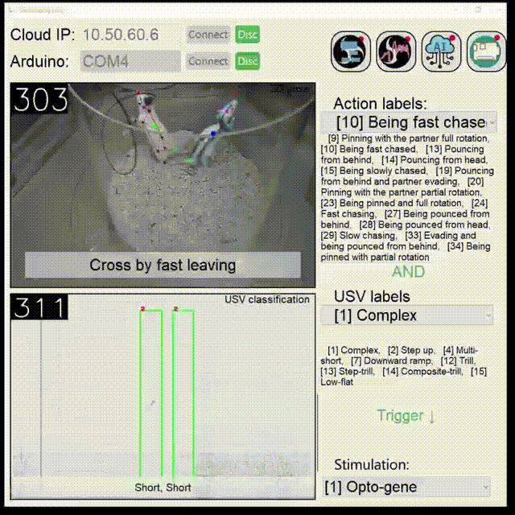
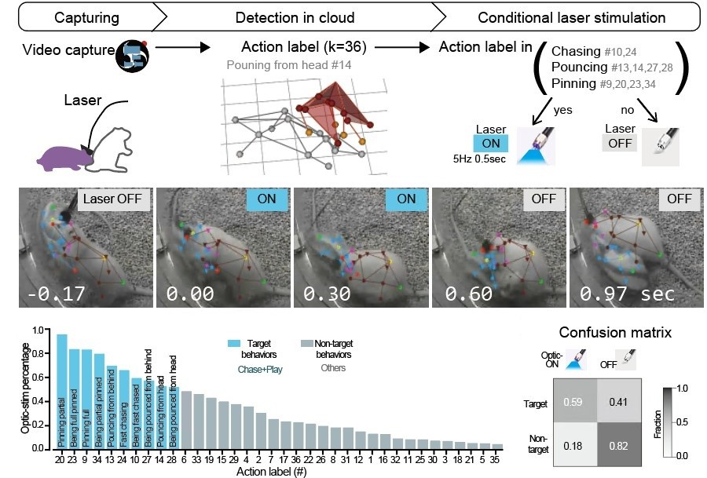
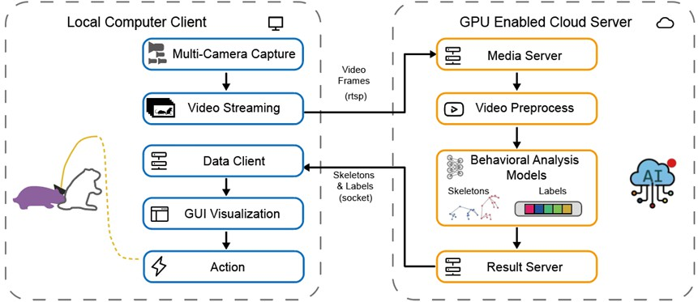

# Social-seq-live Client GUI
Link:[English version](README.md)

基于 Social-seq-live 框架，实现两只大鼠社交行为的实时分析，并根据行为标签决定是否给予闭环光遗传刺激。这里是 Social-seq-live 的客户端部分，不包含服务端代码。

> **注意**
> 大鼠超声频谱分析（USV）目前处于测试阶段，不在主代码中。**当前发行版仅包含行为识别部分**。




录制视频并推流到服务器；服务器进行动物ID分割识别、关键点重构、行为识别并生成标签；客户端获取行为标签后判断是否需要执行光遗传刺激。



## 安装 Social-seq-live 客户端

首先下载代码：

```bash
git clone https://github.com/chenxinfeng4/social-seq-live-client-GUI
cd social-seq-live-client-GUI*
```

然后安装依赖包：

```bash
pip install -r requirement.txt
```

## 运行客户端软件

进入项目目录并运行 `main.py`：

```bash
python main.py
```

## 简明服务端、客户端使用教程

参考以下视频 (assets/MovieS5_realtime_prediction_240821.mp4)：

<video controls>
  <source src="assets/MovieS5_realtime_prediction_240821.mp4" type="video/mp4">
  Your browser does not support the video tag.
</video>

## 实时行为分析系统架构



考虑到实验间电脑性能有限，难以流畅运行优化后的模型，本课题采用了云计算方案。通过以太网络将数据上传到远程的高性能深度学习服务器，利用其更多的GPU资源（4颗NVIDIA RTX3090）。客户端电脑与服务器之间的连接稳定，网络质量高，满足了云计算的网络性能要求。

本课题开发了一套全新的计算架构，包括客户端电脑和服务器两个节点。客户端电脑负责采集视频数据并传输到云服务器，服务器执行动物行为分析流程，并将结果发回客户端电脑，客户端电脑再决定是否给予光遗传刺激。
